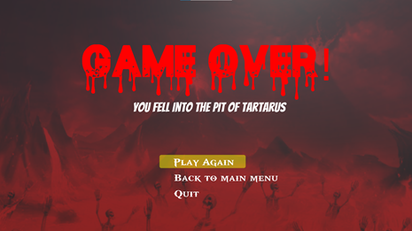

# Revenge of Zeus
Our final project for out B.Sc studies.\
Click here for a demostration video: https://drive.google.com/file/d/1CsdhQ7aSJxIzTNkVA1ciN8imMOh2baww/view?usp=sharing \
Click here to download the game: https://drive.google.com/file/d/1Mhv6OIwZXQCEDEAGoihq4PfCB-_snv_g/view?usp=sharing \
Click here to download the project book that includes our research: https://drive.google.com/file/d/1_4gYJxm7itvYb7C0h5MRYgZduuWBdpJD/view?usp=sharing

## Table of contents
* [General info](#general-info)
* [Technologies](#technologies)
* [Features](#features)
* [Screenshots](#screenshots)

## General info
Revenge of Zeus is a 2.5D fighting game that allows to play against ML trained opponents.\
The player can choose between 3 different agents and play against them, each agent was trained differently.\
This project also includes a research work that analyses those 3 agents in order for us to compare between them\
and conclude which agent gives the best gameplay experience.\
The game also includes a local PvP mode, different settings and 15 characters to play with.

### Dependencies
This project was made with models and animations that we bought in the assets store of Unity.\
Since those assets take a lot of space, we did not include them in this repo.\
Any developer who wants to run this project must buy those assets.\
Click here to buy the models: https://assetstore.unity.com/packages/3d/characters/humanoids/humans/pbr-fighters-pack-145995 \
Click here to buy the animations: https://assetstore.unity.com/packages/3d/animations/fighting-animset-pro-64666 \
Also, this game was made with Unity version `2020.3.30f1` so use this version or higher.

### Setup
1. Clone the repo.
2. Add the GitMerge for Unity asset (more info here: http://flashg.github.io/GitMerge-for-Unity/)

## Technologies
* Unity
* C#
* PyTorch
* Unity ML-Agents Toolkit
* Tensorboard
* GitMerge for Unity

## Features
* Single player with 3 modes, each mode contains a different ML trained agent.
* PvP mode
* Sound, video and controls settings
* 15 differenct character
* 10 different soundtracks during battles
* Pause menu
* Winning, game over, end of match and draw screens
* Loading screen
* Data persistence

## Screenshots
Single player character selection:

PvP characters selection

Battle:

Pause menu:

Winning screen (single player):

Game over screen (single player):

End of match (PvP):

Sound settings:

Controls settings:

Video settings:

